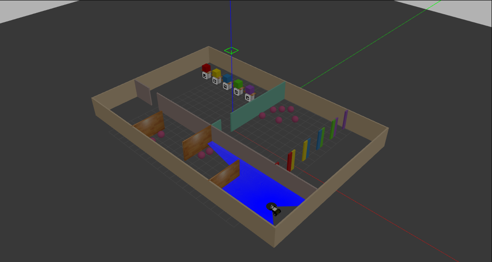

 
 
  

<p align="center">
    
</p>

# Contributors
[Arthur Gomes](https://github.com/arthurgomes4)         
[Pranjal Mishra](https://github.com/Pranjalmishra30)  
[Sahas Agarwal](https://github.com/Veverest)


# Vichesta-Takshak-2021
Submission for Vichesta-Takshak 2021, a pan-india robotics competition organised by IIT-Dhanbad. This solution was awarded the first position.    
View the final presentation [here](https://drive.google.com/drive/u/1/folders/1RB3HhomwGslC3dvN9G3or7PAeE64e1Ou)  
  

## Executing the code locally  
### Install the package  
```  
cd ~/catkin_ws/src  
git clone https://github.com/Pranjalmishra30/Vichesta-Takshak-2021.git  
cd ..  
catkin_make  
source devel/setup.bash        
```  

### Install external packages  
sudo apt install ros-[version]-[package_name]

```  
sudo apt install ros-melodic-move-base  
sudo apt install ros-melodic-gmapping  
sudo apt install ros-melodic-dwa-local-planner  
sudo apt install ros-melodic-explore-lite  
sudo apt install ros-melodic-ros-numpy  
sudo apt install ros-melodic-map-server  
```

### Run the launch file
```
roslaunch takshak launch_all.launch 
```

## Explanation  
### Problem Statement
A robot has to navigate an indoor environment of corridors and rooms while avoiding obstacles and performing ancillary tasks with no human intervention. 
The robot to be used is the Husky-a 4-wheel differential drive robot base with an Intel realsenseD435i depth camera, an RP lidar and an inertial measurement unit.

### Tasks To be Performed
* The aruco markers have to be located and read. Each marker represents a number from 0 to 4. The number represented by the marker has to be matched with the colour of the object above it.  
* The spheres in the arena should be counted. Any number of spheres could be present in any location.  
* The number of spheres is divided by 5. The remainder of the operation corresponds to the marker with the same integer and by extension the associated colour of the marker. The gate with said colour has to be navigated through.

# Future Scope  
1. Currently the hough circles algorithm is unreliable. 3D Point cloud data could be used for more accurate detection.  
2. A 3D map of the environment would result in better obstacle avoidance.  
3. Map precision could be increased at the price of added computation.  

# References  
1. Competition [Github](https://github.com/Kartiksaini001/Vichesta-Takshak-2021)  
2. External packages used  
    * [move_base](http://wiki.ros.org/move_base)     
    * [gmapping](http://wiki.ros.org/gmapping)  
    * [dwa_local_planner](http://wiki.ros.org/dwa_local_planner)   
    * [explore_lite](https://wiki.ros.org/explore_lite)   
    * [ros_numpy](https://wiki.ros.org/ros_numpy)   
    * [map_server](https://wiki.ros.org/map_server)  